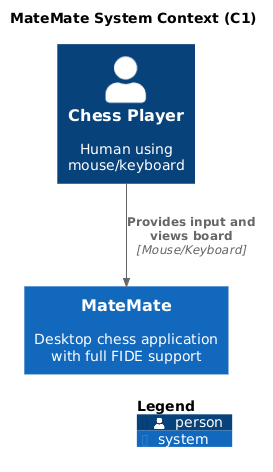

# C4 Level 1: System Context



## System
**MateMate**

## External Actor
**Chess Player**

## Interaction
Player provides mouse/keyboard input, views rendered board

## Boundary
Standalone desktop application, no external systems

## Diagram

```plantuml
@startuml
!include https://raw.githubusercontent.com/plantuml-stdlib/C4-PlantUML/master/C4_Context.puml

title MateMate System Context (C1)

Person(player, "Chess Player", "Human using mouse/keyboard")
System(matemate, "MateMate", "Desktop chess application with full FIDE support")

Rel(player, matemate, "Provides input and views board", "Mouse/Keyboard")

SHOW_LEGEND()
@enduml
```
