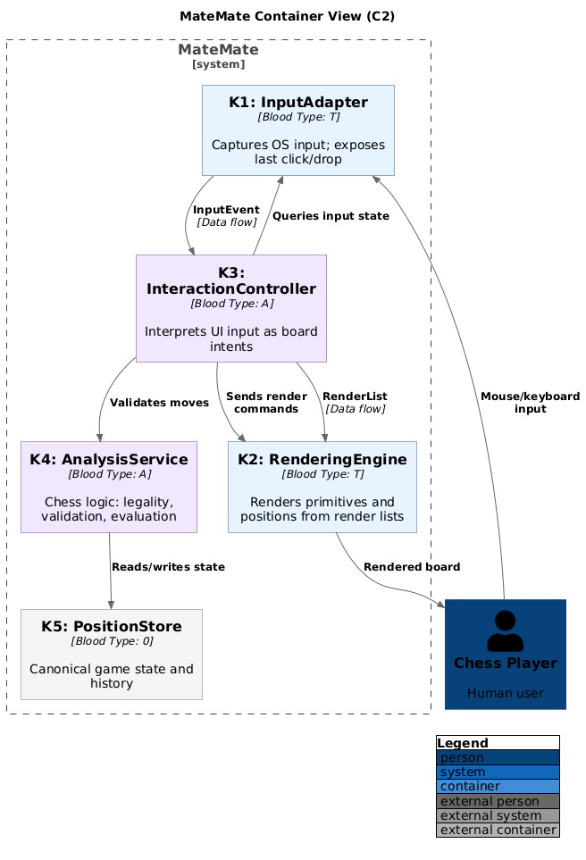

# C4 Level 2: Container View



## Containers

1. **K1 Presentation.InputAdapter** (T)
2. **K2 Presentation.RenderingEngine** (T)
3. **K3 Application.InteractionController** (A)
4. **K4 Domain.AnalysisService** (A)
5. **K5 Core.PositionStore** (0)

## Dependencies

- K3 → K1 (Queries input state)
- K3 → K2 (Sends render commands)
- K3 → K4 (Validates moves)
- K4 → K5 (Reads/writes state)

## Data Flows

- K1 → K3 (InputEvent)
- K3 → K2 (RenderList)

## Diagram

```plantuml
@startuml
!include https://raw.githubusercontent.com/plantuml-stdlib/C4-PlantUML/master/C4_Container.puml

title MateMate Container View (C2)

AddElementTag("technical", $bgColor="#E6F2FF", $borderColor="#1E5AA8")
AddElementTag("application", $bgColor="#F1E6FF", $borderColor="#6A3FB2")
AddElementTag("core", $bgColor="#F5F5F5", $borderColor="#777777")

AddRelTag("dependency", $lineStyle="SolidLine")
AddRelTag("dataflow", $lineStyle="DashedLine")

Person(player, "Chess Player", "Human user")

System_Boundary(matemate, "MateMate") {
    Container(k1, "K1: InputAdapter", "Blood Type: T", "Captures OS input; exposes last click/drop", $tags="technical")
    Container(k2, "K2: RenderingEngine", "Blood Type: T", "Renders primitives and positions from render lists", $tags="technical")
    Container(k3, "K3: InteractionController", "Blood Type: A", "Interprets UI input as board intents", $tags="application")
    Container(k4, "K4: AnalysisService", "Blood Type: A", "Chess logic: legality, validation, evaluation", $tags="application")
    Container(k5, "K5: PositionStore", "Blood Type: 0", "Canonical game state and history", $tags="core")
}

Rel(player, k1, "Mouse/keyboard input")
Rel(k2, player, "Rendered board")

Rel(k1, k3, "InputEvent", "Data flow", $tags="dataflow")
Rel(k3, k2, "RenderList", "Data flow", $tags="dataflow")

Rel(k3, k1, "Queries input state", $tags="dependency")
Rel(k3, k2, "Sends render commands", $tags="dependency")
Rel(k3, k4, "Validates moves", $tags="dependency")
Rel(k4, k5, "Reads/writes state", $tags="dependency")

LAYOUT_WITH_LEGEND()
@enduml
```
